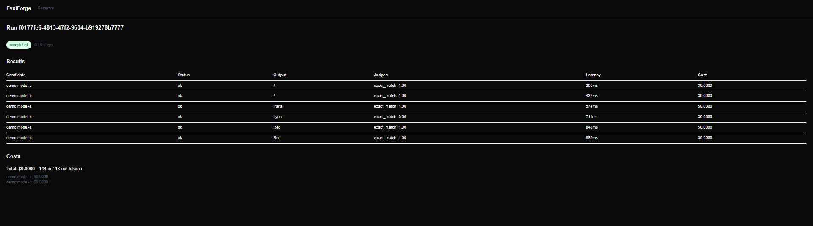
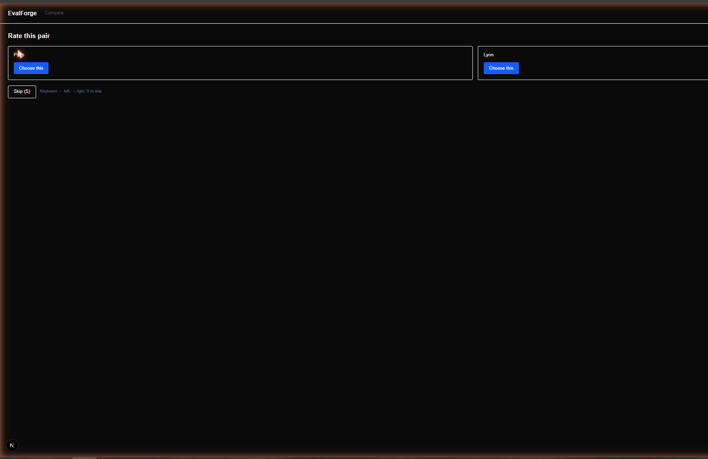
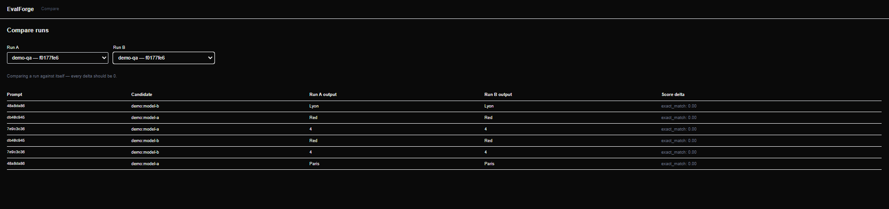

# EvalForge

**An open-source LLM evaluation platform.** Define prompt suites, run them
against multiple model providers concurrently, score outputs with pluggable
judges — including a fine-tuned local hallucination detector — collect blind
human preference votes, and diff any two runs to catch regressions.

[](https://github.com/Larmstrong1127/evalforge/actions/workflows/ci.yml)
[](LICENSE)

```
Dashboard (Next.js + TypeScript)
  suites · runs & results · costs · blind A/B rating room · run-vs-run compare
        | REST (OpenAPI)
API (FastAPI + Pydantic)
  suites · prompt versioning · runs · results · ratings · compare
Eval Runner (asyncio)
  bounded concurrency · per-item failure isolation · cost & latency tracking
Providers (plugin)             Judges (plugin)
  claude / openai /              exact_match / llm_judge /
  gemini / ollama                deberta-hallucination (ours, fine-tuned)
        |
PostgreSQL (SQLite fallback for zero-setup dev)

training/  — separate PyTorch package that produced the DeBERTa judge
```

## Screenshots

| Run results | Blind A/B rating room | Run-vs-run compare |
|---|---|---|
|  |  |  |

## Quickstart

```bash
docker compose up --build
```

Then open **http://localhost:3000** — the demo comes pre-seeded (no API keys
needed): browse the `demo-qa` suite, open its completed run's results and
costs, cast blind votes in the rating room, and compare the run against
itself in the compare view.

To launch **real** evaluation runs from the demo:

- **Local models (free):** run [Ollama](https://ollama.com) on the host —
  the API container is pre-pointed at `host.docker.internal:11434`. Launch a
  run with a candidate like `ollama:llama3.2`.
- **Cloud models:** set `EVALFORGE_ANTHROPIC_API_KEY` /
  `EVALFORGE_OPENAI_API_KEY` / `EVALFORGE_GEMINI_API_KEY` on the `api`
  service and use candidates like `anthropic:claude-sonnet-5`.

## The fine-tuned judge, honestly

The `training/` package fine-tunes `deberta-v3-base` for binary
hallucination detection on HaluEval, holds out RAGTruth (real RAG-system
hallucinations) as a hard out-of-distribution test set, and benchmarks the
result against cloud LLM judges. The headline finding is the
generalization gap — reported as the finding, not hidden:

| Config | In-distribution F1 | OOD F1 (RAGTruth) | OOD ECE |
|---|---|---|---|
| **lr-2e5 (shipped)** | 0.9937 | **0.5067** | **0.4010** |
| lr-5e5 | **0.9942** | 0.4735 | 0.6163 |
| lr-1e4 | 0.9937 | 0.4814 | 0.5766 |

Selecting by validation F1 alone would have shipped the *worst* real-world
generalizer (`lr-5e5`) — the entire reason the design held RAGTruth out as
an untouched evaluation set.

**Benchmark** — 200 RAGTruth examples, local judge vs. cloud judges via the
platform's own provider adapters:

| Judge | Agreement | Cost / 1K evals | p50 latency |
|---|---|---|---|
| **local-deberta (ours)** | 47.5% | **$0.00** | **27 ms** |
| claude-sonnet-5 | **85.0%** | $4.06 | 1466 ms |
| gpt-4o | 82.5% | $2.03 | 1311 ms |
| gemini-2.5-flash-lite | 78.5% | $0.08 | 1182 ms |

Free and 43x faster, but not a drop-in replacement for a paid judge on
out-of-distribution data — its realistic role today is a cheap first-pass
filter. Full methodology, training curves, and a candid **"what didn't
work"** section (CUDA OOMs, a label-parsing bug that would have poisoned the
dataset, a lost paid benchmark result, and more) live in
[`training/README.md`](training/README.md). The shipped checkpoint is
published on [Hugging Face Hub](https://huggingface.co/DantheMan124/deberta-hallucination-judge)
and wired into the platform as the `deberta-hallucination` judge
(optional extra: `pip install -e "platform/api[deberta]"`).

## Project layout

| Path | What it is |
|---|---|
| [`platform/api`](platform/api) | FastAPI backend: async runner, provider/judge plugins, REST API, CLI |
| [`platform/dashboard`](platform/dashboard) | Next.js frontend: suites, runs, rating room, compare |
| [`training`](training) | PyTorch fine-tuning pipeline for the DeBERTa judge (hand-written loop, no HF Trainer) |
| [`docs/adr`](docs/adr) | Architecture decision records (asyncio-not-Celery, commit-before-BackgroundTask, …) |
| [`docs/design`](docs/design) | Per-phase design specs and implementation plans |

## Quality

- **Tests:** 72 backend (pytest, incl. a regression test reproducing a real
  FastAPI `BackgroundTasks`/session-commit ordering bug with two separate DB
  engines), 29 training, 10 frontend (vitest). Backend and dashboard are
  `ruff`/`mypy --strict` and `eslint`/`tsc` clean; the training package is
  `ruff` clean but its ML-heavy scripts (`train.py`, `evaluate.py`,
  `benchmark.py`) aren't run under `--strict` since third-party ML APIs
  (torch, HF schedulers, TensorBoard) don't type cleanly at that level.
- **CI:** lint/type/test on every PR, plus an **eval gate** — a fixed prompt
  suite runs against a pinned local model on every platform PR and fails the
  build on score collapse. The platform gates its own CI with itself.
- **History:** conventional commits throughout; every phase shipped through
  a written design spec, an implementation plan, and code review — the specs
  and plans are in the repo.

## Roadmap

- SSE for live run progress (replacing the v1 polling).
- Reward-model training on the rating room's collected preference pairs.
- Cloud deploy (Terraform/ECS) — deferred; the Compose demo covers local use.

## License

[MIT](LICENSE)
