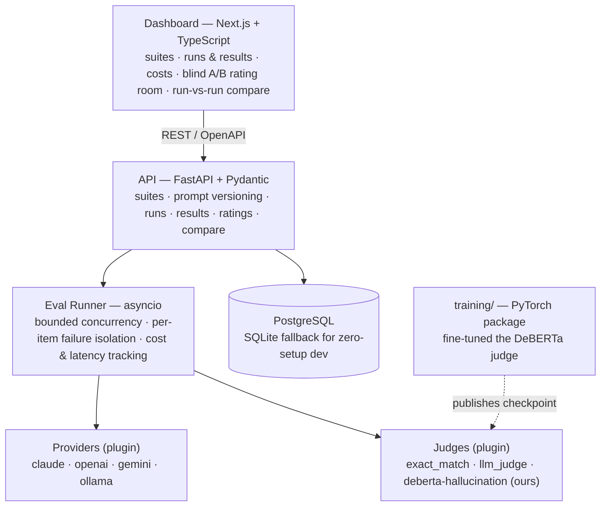

# EvalForge

**An open-source LLM evaluation platform.** Define prompt suites, run them
against multiple model providers concurrently, score outputs with pluggable
judges — including a fine-tuned local hallucination detector — collect blind
human preference votes, and diff any two runs to catch regressions.

[](https://github.com/Larmstrong1127/evalforge/actions/workflows/ci.yml)
[](LICENSE)

Two models were trained for this platform rather than merely called:

- **[Preference reward model](https://huggingface.co/DantheMan124/deberta-preference-reward)** — DeBERTa-v3 Bradley-Terry, hand-written dual-forward PyTorch loop, 184M params. **0.7026** pairwise accuracy on a held-out UltraFeedback split vs **0.6009** for `OpenAssistant/reward-model-deberta-v3-large-v2` (435M) scored on the same 1,987 pairs. Caveat, stated up front: that split is in-distribution for this model and out-of-distribution for the baseline — [full honest write-up below](#the-preference-reward-model-honestly).
- **[Hallucination judge](https://huggingface.co/DantheMan124/deberta-hallucination-judge)** — runs locally at 27 ms and $0.00 per call, wired in as a first-class judge.



## Screenshots

| Run results | Blind A/B rating room | Run-vs-run compare |
|---|---|---|
|  |  |  |

## Quickstart

```bash
docker compose up --build
```

Then open **http://localhost:3000** — the demo comes pre-seeded (no API keys
needed): browse the `demo-qa` suite, open its completed run's results and
costs, cast blind votes in the rating room, and compare the run against
itself in the compare view.

To launch **real** evaluation runs from the demo:

- **Local models (free):** run [Ollama](https://ollama.com) on the host —
  the API container is pre-pointed at `host.docker.internal:11434`. Launch a
  run with a candidate like `ollama:llama3.2`.
- **Cloud models:** set `EVALFORGE_ANTHROPIC_API_KEY` /
  `EVALFORGE_OPENAI_API_KEY` / `EVALFORGE_GEMINI_API_KEY` on the `api`
  service and use candidates like `anthropic:claude-sonnet-5`.

> The screenshots above and the seed data behind them are from running the
> API and dashboard directly (no Docker) against the same code that ships in
> `docker-compose.yml` — the dev machine this was built on doesn't have
> Docker installed. The compose file and both Dockerfiles are logically
> straightforward (standard multi-stage Next.js standalone build, plain
> `pip install` for the API) but an actual `docker compose up --build` run
> hasn't been verified end-to-end. Flagging this rather than claiming
> verification I don't have.

### No Docker

```bash
# terminal 1
cd platform/api && pip install -e ".[dev]" && EVALFORGE_SEED_DEMO=1 uvicorn evalforge.main:app
# terminal 2
cd platform/dashboard && npm install && npm run dev
```

## The fine-tuned judge, honestly

The `training/` package fine-tunes `deberta-v3-base` for binary
hallucination detection on HaluEval, holds out RAGTruth (real RAG-system
hallucinations) as a hard out-of-distribution test set, and benchmarks the
result against cloud LLM judges. The headline finding is the
generalization gap — reported as the finding, not hidden:

| Config | In-distribution F1 | OOD F1 (RAGTruth) | OOD ECE |
|---|---|---|---|
| **lr-2e5 (shipped)** | 0.9937 | **0.5067** | **0.4010** |
| lr-5e5 | **0.9942** | 0.4735 | 0.6163 |
| lr-1e4 | 0.9937 | 0.4814 | 0.5766 |

Selecting by validation F1 alone would have shipped the *worst* real-world
generalizer (`lr-5e5`) — the entire reason the design held RAGTruth out as
an untouched evaluation set.

**Benchmark** — 200 RAGTruth examples, local judge vs. cloud judges via the
platform's own provider adapters:

| Judge | Agreement | Cost / 1K evals | p50 latency |
|---|---|---|---|
| **local-deberta (ours)** | 47.5% | **$0.00** | **27 ms** |
| claude-sonnet-5 | **85.0%** | $4.06 | 1466 ms |
| gpt-4o | 82.5% | $2.03 | 1311 ms |
| gemini-2.5-flash-lite | 78.5% | $0.08 | 1182 ms |

_The benchmark table above is generated from
[`training/benchmark_results.json`](training/benchmark_results.json) by
[`training/scripts/gen_results_table.py`](training/scripts/gen_results_table.py) —
the numbers are reproducibly derived, not hand-typed._

Free and 43x faster, but not a drop-in replacement for a paid judge on
out-of-distribution data — its realistic role today is a cheap first-pass
filter. Full methodology, training curves, and a candid **"what didn't
work"** section (CUDA OOMs, a label-parsing bug that would have poisoned the
dataset, a lost paid benchmark result, and more) live in
[`training/README.md`](training/README.md). The shipped checkpoint is
published on [Hugging Face Hub](https://huggingface.co/DantheMan124/deberta-hallucination-judge)
and wired into the platform as the `deberta-hallucination` judge
(optional extra: `pip install -e "platform/api[deberta]"`); its full
[model card](training/MODEL_CARD_hallucination_judge.md) is in the repo.

## Project layout

| Path | What it is |
|---|---|
| [`platform/api`](platform/api) | FastAPI backend: async runner, provider/judge plugins, REST API, CLI |
| [`platform/dashboard`](platform/dashboard) | Next.js frontend: suites, runs, rating room, compare |
| [`training`](training) | PyTorch fine-tuning pipeline for the DeBERTa judge (hand-written loop, no HF Trainer) |
| [`docs/adr`](docs/adr) | Architecture decision records (asyncio-not-Celery, commit-before-BackgroundTask, …) |
| [`docs/design`](docs/design) | Per-phase design specs and implementation plans |

## Quality

- **Tests:** 76 backend (pytest, incl. a regression test reproducing a real
  FastAPI `BackgroundTasks`/session-commit ordering bug with two separate DB
  engines), 50 training, 10 frontend (vitest). Backend and dashboard are
  `ruff`/`mypy --strict` and `eslint`/`tsc` clean; the training package is
  `ruff` clean but its ML-heavy scripts (`train.py`, `evaluate.py`,
  `benchmark.py`) aren't run under `--strict` since third-party ML APIs
  (torch, HF schedulers, TensorBoard) don't type cleanly at that level.
- **CI:** lint/type/test on every PR, plus an **eval gate** — a fixed prompt
  suite runs against a pinned local model on every platform PR and fails the
  build on score collapse. The platform gates its own CI with itself. The
  recorded baseline (0.375, measured against a real local `llama3.2`) is
  deliberately low: `exact_match` is a strict judge and a 3B model rambles —
  the gate exists to catch *regressions in the platform's plumbing*, not to
  showcase model quality. A pipeline bug that drops scores to 0 fails the
  build; the absolute number is beside the point.
- **History:** conventional commits throughout; every phase shipped through
  a written design spec, an implementation plan, and code review — the specs
  and plans are in the repo.

## The preference reward model, honestly

Phase 5 closed the platform's preference loop: a DeBERTa-v3 Bradley-Terry
reward model, trained with a hand-written dual-forward PyTorch loop on
UltraFeedback-binarized (60,700 pairs, 512 tokens, audited truncation),
temperature-calibrated (T=1.167), and wired in as the `reward` judge — the
first judge that scores any (prompt, output) pair with no golden answer.

Every row below is the same split through the same harness
(`training/eval_reward.py`, `training/eval_reward_baseline.py`):

| Model / split | Params | N | Pairwise accuracy |
|---|---|---|---|
| Chance floor (balanced binary choice) | — | — | 0.5000 |
| `OpenAssistant/reward-model-deberta-v3-large-v2` (public baseline, OOD for it) | 435M | 1,987 | 0.6009 |
| **This model** — UltraFeedback test_prefs (ID) | 184M | 1,987 | **0.7026** |
| Human OOD probe (this rating room, blind A/B on real llama3.2 vs qwen2.5:14b outputs) | 184M | 15 | 0.4000 |

The baseline row is what makes 0.7026 readable rather than unanchored — but
it is not a claim of superiority. This model is *in*-distribution on
UltraFeedback and the public model, trained on a different preference mixture
(WebGPT / summarize-from-feedback / Anthropic HH), is *out* of it. The honest
symmetric result is the last row: on human votes, this model drops to chance
too. What the comparison does establish is the tradeoff the project set out to
test — a 184M local judge that costs nothing per call, measured against a
2.4x-larger public model in the same harness instead of asserted.

Note also that the reward score is *relative*: Bradley-Terry identifies rewards
only up to an additive constant, so only comparisons between two responses to
the same prompt are meaningful. The `reward` judge's score is the
temperature-scaled logit for exactly that reason, and `sigmoid` of a score
*difference* is the calibrated preference probability.

The probe is tiny by construction and reported as a probe — but the
direction matches the literature: AI-feedback preference data has a
length/elaboration bias that doesn't transfer to an individual human. The
model predicts *UltraFeedback-style* preferences, not yours; the rating
room exists precisely to accumulate the human data that closes that gap.
Also documented in the model card
([Hub](https://huggingface.co/DantheMan124/deberta-preference-reward) ·
[repo](training/MODEL_CARD_preference_reward.md)):
the lr-5e5 run collapsing to chance, and the 1024-token attempt dying at
hour 8.5 with a CUDA fault before its first checkpoint (9–12 h/epoch was
economically infeasible on one 3090; 512 tokens costs 1 dropped pair in
62,688).

A later self-audit caught the tail of that abandoned 1024 attempt: the
eval/calibration scripts and the `reward` judge still *defaulted* to 1024
against a 512-token checkpoint. Re-measuring on the same held-out split
confirmed the published numbers above were unaffected — they were produced
at 512, and the re-run reproduces the stored temperature bit-for-bit — but
the judge had genuinely been *serving* at 1024, and 39% of held-out pairs
exceed 512 tokens on one side, so it was scoring off-regime in production.
The sequence budget is now derived from the checkpoint's own config rather
than restated in three files. Written up in full in the
[model card](training/MODEL_CARD_preference_reward.md#correction-2026-07-26-trainserve-sequence-length-mismatch).

## Roadmap

- SSE for live run progress (replacing the v1 polling).
- Re-train the reward model on accumulated rating-room votes once N is
  meaningful (the closed loop's whole point).
- Cloud deploy (Terraform/ECS) — deferred; the Compose demo covers local use.

## License

[MIT](LICENSE)
